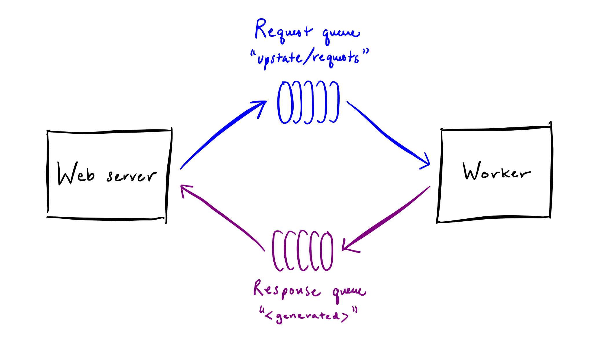
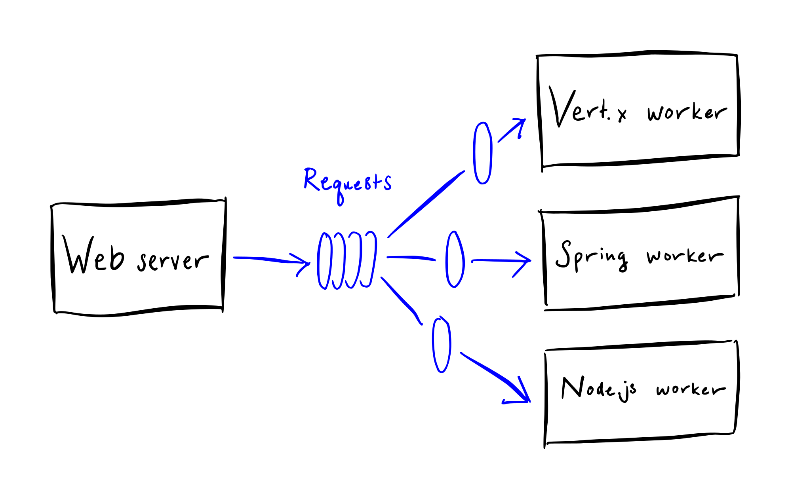

# Upstate

Upstate is a messaging app demonstrating the use of a shared work
queue and multiple workers.

The backend workers are implemented three different ways - in Node.js,
Spring Boot, Vert.x, and WildFly Swarm.  The frontend is a single-page
web application.  The web server communicates over HTTP with the
browser and over AMQP 1.0 with the workers.

Upstate is designed to run on OpenShift or any other variety of
Kubernetes.

## Components

 - **Node.js web server** - [server.js](web-nodejs/server.js)
 - **Node.js worker** - [server.js](worker-nodejs/server.js)
 - **Spring Boot worker** - [SpringWorker.java](worker-spring/src/main/java/org/amqphub/upstate/spring/SpringWorker.java)
 - **Vert.x worker** - [VertxWorker.java](worker-vertx/src/main/java/org/amqphub/upstate/vertx/VertxWorker.java)
 - **WildFly Swarm worker** - [SwarmWorker.java](worker-swarm/container/src/main/java/org/amqphub/upstate/swarm/SwarmWorker.java)

## Design

