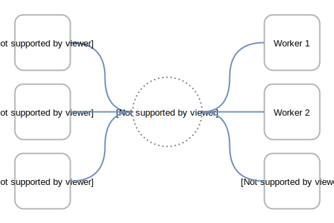
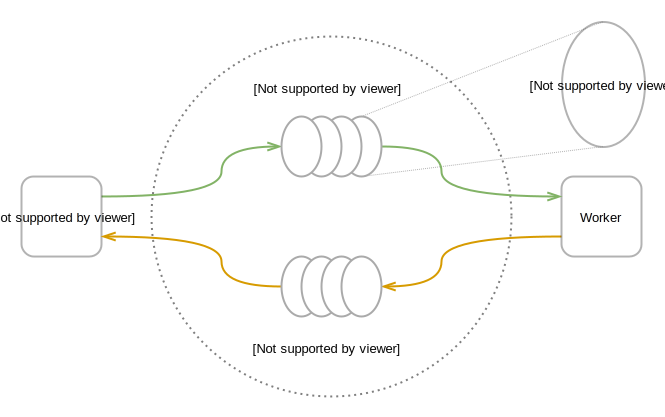
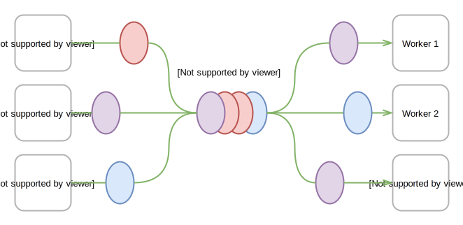
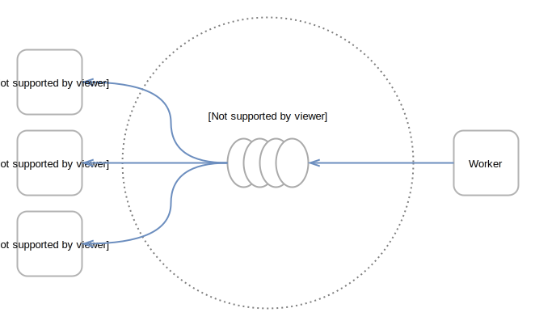
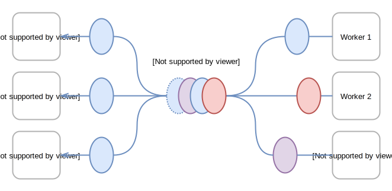

= Scalable task processing using a shared work queue

:toc:

[options="header"]
|=== 
| ID | Short Name
| `200` | `messaging-work-queue`
|===

== Description

This mission demonstrates how to dispatch tasks to a scalable set of
worker services using a message queue.  It uses the AMQP 1.0 message
protocol to send and receive messages.  The workers can be implemented
in a variety of different languages and application runtimes.

Having a single, well-known shared resource for adding and consuming
work makes it easier to scale the number of workers up and down.  The
frontend does not need to know any of the details of the backend
workers.  The use of a standard messaging protocol enables frontends
and workers written in any language to interoperate.

This mission covers:

* Sending work requests to a common work queue
* Receiving and processing work requests as they come in
* Sending the processed result back to the requesting service
* Adding new workers as demand increases or removing workers as it dies down
* Monitoring the current state of the worker services

== User problem

The user has a large number of discrete tasks that require processing.
To make sure they are processed with satisfactory speed, the user
wants to be able to add worker services on demand as the number of
outstanding tasks grows.

One could achieve this by telling every requesting service about every
worker service, but that requires updating many potential requesters.
Instead, the user wants to design the system so that the requester
does not need to know how many workers there are, and the workers do
not need to know which service the request came from.

== Concepts and architectural patterns

This mission contains a distributed messaging application that
demonstrates the request-response messaging pattern. It contains
multiple services that communicate using a messaging server.

* Sending and receiving messages.  The application uses the AMQP
  message protocol to communicate using anycast and multicast message
  distribution.

* Sending request messages and receiving response messages.  The
  application demonstrates how the request-response messaging pattern
  is implemented in AMQP.

* Periodically sending broadcast updates.  The application
  demonstrates use of the publish-subscribe messaging pattern for
  distributing information to multiple receivers.

* Maintaining connections between services.  The frontend and backend
  components reconnect to the message server if the connection is
  lost.

* Scaling backend workers up and down.  The operator can freely add
  and remove backend workers.

=== Application components

This application is implemented as multiple independent services that
communicate over the network.  Your web browser communicates with the
frontend web server over HTTP.  The frontend communicates with workers
over AMQP by way of an intermediary messaging service.  The messaging
service can be a message broker, a message router, or a cloud
messaging service.

.Application components and network protocols
image::images/protocols.svg[]

There can be multiple instances of the frontend and worker services.
Frontends and workers can be added and removed dynamically.
Each instance of a service maintains a network connection to the messaging service.

.Component instances and network connections

=== Work requests and worker responses

A work request takes the form of an AMQP message.  The messaging
service provides a shared message queue named `work-queue/requests`.
Frontend services add new requests to the front of the queue, and
worker services remove requests from the back of the queue.

After processing, a worker responds with another AMQP message
containing the processed result.  When the frontend first creates a
link to the request queue, it also establishes a queue for responses.
It includes the address of this queue in each work request.  When the
worker finishes processing a request, it sends the result to the
pre-established response queue.

.The request-response pattern

Each work request is processed once by the worker that removed it from
the queue.  Faster workers will process more work requests, and slower
workers fewer.  The workload is balanced across the workers according
to their processing capacity.

.Work requests

Each worker response is sent to the dedicated response queue of the
frontend that initiated the request.

.Worker responses
image::images/responses.svg[]

=== Worker status updates

.The publish-subscribe pattern

.Worker status updates

////
The frontend, a web server, registers requests to perform work by
sending a request message to a well known queue.  A backend worker
then fetches the work request from the queue and performs the work.

The frontend uses HTTP to communicate with a browser.  The browser
submits new requests by performing HTTP POSTs, and it polls for
responses by performing periodic HTTP GETs.  This approach may or may
not fit the needs of your application.  An alternative approach might
consume push events delivered directly to the browser.
////

== Use case

////
=== Deployment

. Apply the OpenShift templates to your current project.  The
  templates create OpenShift entities that are used in subsequent
  steps.
+
[source, shell]
----
oc apply -f templates/
----

. Create the broker application.  This command configures and deploys
  the broker.
+
[source, shell]
----
oc new-app --template=amq63-basic \
  -p APPLICATION_NAME=work-queue-broker \
  -p IMAGE_STREAM_NAMESPACE=$(oc project -q) \
  -p MQ_PROTOCOL=amqp \
  -p MQ_QUEUES=work-queue/requests,work-queue/responses \
  -p MQ_TOPICS=work-queue/worker-updates \
  -p MQ_USERNAME=work-queue \
  -p MQ_PASSWORD=work-queue
----

. Create the frontend application.  This command builds and deploys
  the frontend web server.
+
Replace `<runtime>` with your chosen runtime.  The options are
`nodejs`, `spring-boot`, `wfswarm`, and `vertx`.
+
[source, shell]
----
oc new-app --template=<runtime>-messaging-work-queue-frontend
----

. Create the worker application.  This command builds and deploys the
  backend worker.
+
[source, shell]
----
oc new-app --template=<runtime>-messaging-work-queue-worker
----

=== Operation
////

. Navigate to the frontend web server.  Use the URL shown under the
  `<runtime>-messaging-work-queue-frontend` application in the project
  overview.

. Enter text in the *Requests* form field.  The system will be responsible 
for perfoming a "to upper case" operation on the input, returning the result, which 
is also tagged with the worker ID.

. See the response text in uppercase under *Responses*.

. In the OpenShift console, increase the number of worker pods to two.

. In the frontend web interface, note the presence of two workers
  under *Workers*.

. Submit multiple requests.

. See responses returned from each worker in turn.

== Acceptance criteria

=== Frontend

* An HTTP POST to `http://FRONTEND/api/send-request` with the
  following JSON payload returns with status code 202.  The body of
  the response is an ID representing the request.
+
.HTTP request (application/json)
[source, json]
----
{
  "text": "abc",
  "uppercase": true,
  "reverse": false
}
----
+
.HTTP response (text/plain)
[source]
----
vertx-frontend-78c3/1
----

* An HTTP GET to
  `http://FRONTEND/api/receive-response?request=REQUEST-ID` returns
  the following JSON payload representing the response with status
  200+++.+++  `REQUEST-ID` is the ID returned from `/send-request`.
+
.HTTP response (application/json)
[source, json]
----
{
  "requestId": "vertx-frontend-78c3/1",
  "workerId": "vertx-worker-d423",
  "text": "ABC"
}
----
+
If processing of the request is not yet finished, the call returns
status 404.

* Subsequent GET requests to `http://FRONTEND/api/data` contain the
  following JSON, which represents all requests that have been
  processed by the system.
+
.HTTP response (application/json)
[source, json]
----
{
  "requestIds": ["vertx-frontend-78c3/1", "vertx-frontend-78c3/2"],
  "responses": {
    "vertx-frontend-78c3/1": {
      "requestId": "vertx-frontend-78c3/1",
      "workerId": "vertx-worker-d423",
      "text": "ABC"
    },
    "vertx-frontend-78c3/2": {
      "requestId": "vertx-frontend-78c3/2",
      "workerId": "nodejs-worker-7f4a",
      "text": "XYZ"
    }
  },
  "workers": {}
}
----

* Workers send periodic status updates to the frontend.  Their current
  status is also represented in the JSON returned from
  `http://FRONTEND/api/data`.
+
.HTTP response (application/json)
[source, json]
----
{
  "requestIds": [],
  "responses": {},
  "workers": {
    "vertx-worker-d423": {
      "workerId": "vertx-worker-d423",
      "timestamp": 1529684986,
      "requestsProcessed": 100,
      "processingErrors": 0
    },
    "nodejs-worker-7f4a": {
      "workerId": "nodejs-worker-7f4a",
      "timestamp": 1529684991,
      "requestsProcessed": 99,
      "processingErrors": 1
    }
  }
}
----

=== Queues and topics

All queues and topics use the prefix `work-queue` to avoid collisions
with any other applications using the broker.

* Queue `work-queue/requests`

* Topic `work-queue/worker-updates`

Some runtime environments do not allow for creation of dynamic reply
queues.  In these cases, a queue named `work-queue/responses` is used.

* Queue `work-queue/responses`

=== Worker IDs

Worker IDs take the form `worker-<runtime>-<four-digit-unique-ID>`,
where `<runtime>` is one of `nodejs`, `spring`, `wfswarm`, or
`vertx`. Examples:

* `worker-nodejs-4d78`
* `worker-wfswarm-18ac`
* `worker-spring-dc7e`

=== Request message format

On receiving user input, the frontend sends a request message to the
`work-queue/requests` queue.  Workers consume new requests from the
queue.

The request message must have the following elements.

* Property `message-id`: A unique request ID (AMQP string)

* Property `reply-to`: Either a dynamically generated reply queue (if
  possible) or `work-queue/responses` (AMQP string)

* Application property `uppercase`: A boolean indicating whether to
  uppercase the text (AMQP boolean)

* Application property `reverse`: A boolean indicating whether to
  reverse the text (AMQP boolean)

* Body: Text supplied by the user (AMQP string)

=== Response message format

After processing a request, the worker sends a response message to the
queue indicated by the `reply-to` property of the request message.

The response message must have the following elements.

* Property `correlation-id`: The request ID associated with this
  response (AMQP string)

* Application property `workerId`: The worker ID (AMQP string)

* Body: The user text after processing (AMQP string)

=== Worker update message format

Workers send update messages every five seconds to the
`work-queue/worker-updates` topic.  The frontend subscribes to the
topic and keeps the latest status for each worker.

The update message must have the following elements.

* Application property `timestamp`: The current time in milliseconds
  (AMQP long)

* Application property `workerId`: The worker ID (AMQP string)

* Application property `requestsProcessed`: The total number of
  requests processed (AMQP long)

* Application property `processingErrors`: The total number of
  errors encountered during processing (AMQP long)

== Notes

Node.js booster - <https://github.com/ssorj/nodejs-messaging-work-queue>

Spring Boot booster - <https://github.com/gytis/spring-boot-messaging-booster>

WildFly Swarm booster - <https://github.com/ssorj/wfswarm-messaging-work-queue>

Vert.x booster - <https://github.com/ssorj/vertx-messaging-work-queue-booster>

// unchecked = &#x2610;
// checked = &#x2611;
